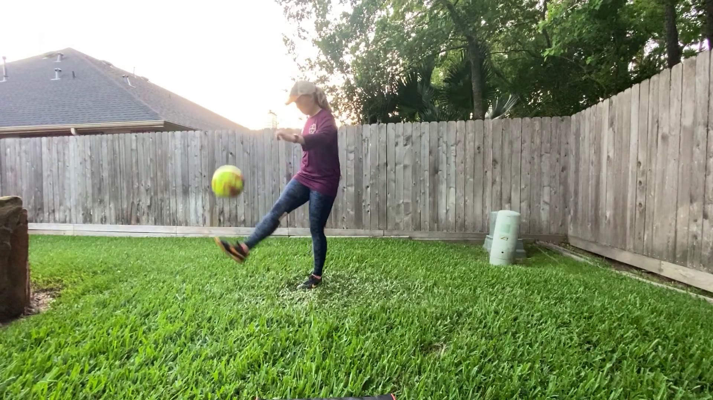
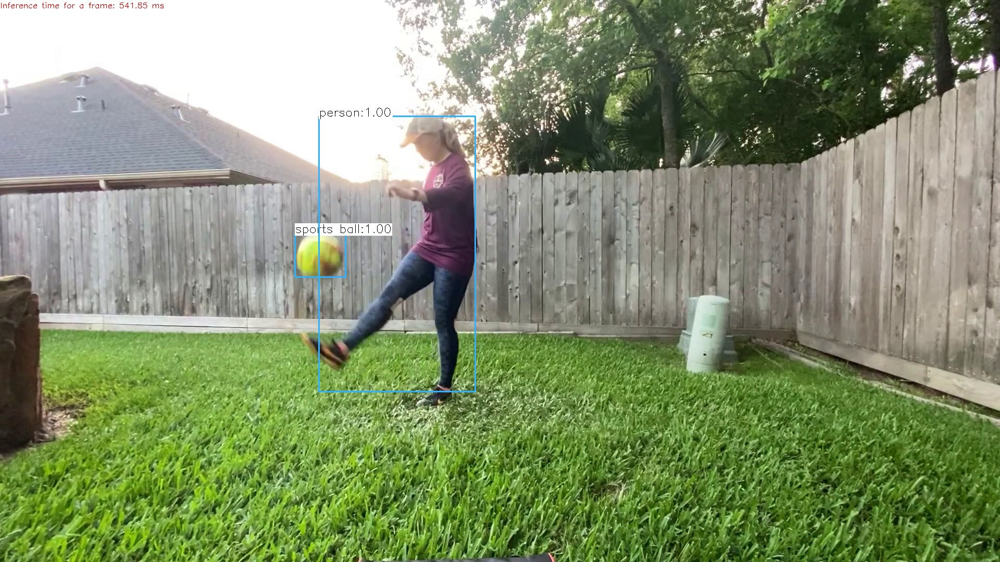
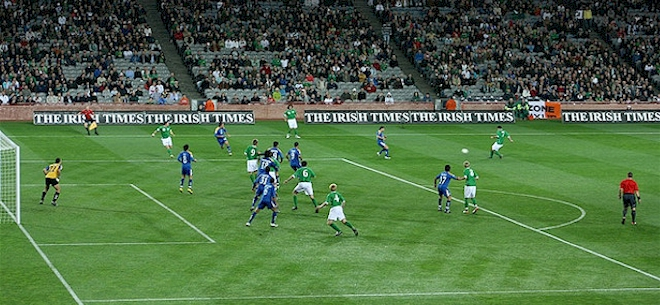
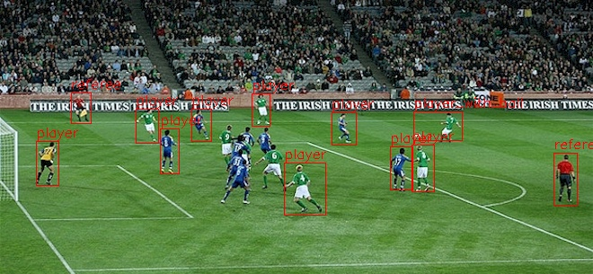
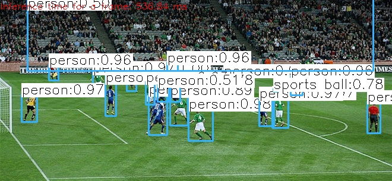

# Learning OpenCV

This repository is where I experiment with OpenCV, initially in C++

OpenCV build: 4.3.0

Makefile compiles each .cpp to its own individual .o and then links to its own individual binary.

Using **Learning OpenCV 3**, *Adrian Kaehler and Gary Bradski* as a reference.

Source files beginning with "ex_" are examples from the text, where the first number following is the chapter number.

Source files beginning with "xrs_" are exercises from the text, where the first number following is the chapter number.

[src/obj_detect_yolov3.cpp](src/obj_detect_yolov3.cpp) uses OpenCV's DNN backend for YOLOv3 object detection.

I started with an example from [LearnOpenCV](https://github.com/spmallick/learnopencv/blob/master/ObjectDetection-YOLO/object_detection_yolo.cpp) and modified for my own uses.

Here is a still frame from a video I took of my wife juggling a soccer ball in our backyard.  The first image is as recorded from the video:

And the second image is after running it through the pretrained [YOLOv3](https://pjreddie.com/darknet/yolo/)

I currently am running the code using CPU instead of GPU as my hardware is kind of old.  Using an Intel Core i5-2500K 3.3 GHz Quad-Core processor it takes on average 554 ms to process each frame using all four cores.

[src/annotate_image.cpp](src/annotate_image.cpp) is an intial attempt at creating a tool for annotating images as future input to a custom-trained YOLOv3.  The user is able to read in an image, draw a bounding box, and input a label (via the command line prompt).  The annotated image is then output.

And here is the same image when passed through obj_detect_yolov3.cpp:

